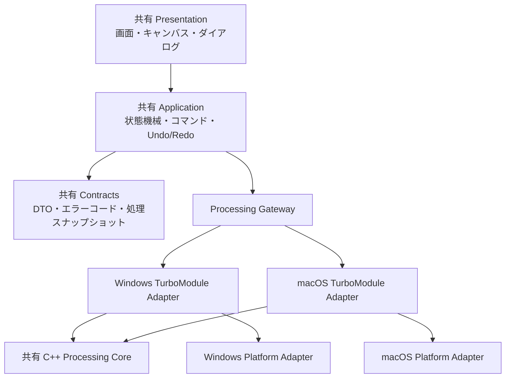

# アプリケーションアーキテクチャ基本設計案

## この文書の責務

この文書は、CSVMapper のアプリケーション構成、レイヤ責務、依存方向、実行境界、技術選定候補、配布単位の基本設計案を定義する。

## ステータス

技術検証用の設計案であり、`NFR-ENV-005` の検証完了までは確定基本設計として扱わない。順序 1 のプロトタイプには使用できるが、順序 2 以降の製品実装には使用しない。

## この文書で扱う正本範囲

OS 別ホストと共通モジュールの構成、レイヤ責務、依存方向、スレッド境界、ディレクトリ構成、ビルド・配布単位。

## 参照する正本

- 要件: `docs/requirements.md`
- 機能の振る舞い: `docs/specs/features/`
- ドメイン規則: `docs/specs/domain/`
- 状態遷移: `docs/specs/states/application-session.md`
- 非機能要件: `docs/non-functional.md`
- キャンバス: `docs/specs/design/mapping-canvas.md`
- ネイティブ処理: `docs/specs/modules/processing-core.md`

## 対象範囲

Windows 版と macOS 版のアプリケーションホスト、共有 UI、アプリケーション状態、共有処理コア、OS アダプター、ビルド、配布。

## 対象外

各文字列変換の業務規則、CSV の構文、画面ごとの操作条件、最終的なブランド表現、CI サービスの選定。

## 設計方針

- Windows と macOS は OS 別の React Native アプリケーションホストを持つ。
- 画面、状態機械、操作コマンド、契約型は TypeScript の共通パッケージとして共有する。
- CSV 解析、文字コード変換、書記素処理、グラフ評価、プレビュー、出力は C++ の処理コアを共有する。
- OS 固有のファイルダイアログ、ファイル識別、置換、フォルダ表示、ログ保存先はアダプターへ閉じ込める。
- UI スレッドではファイル全体の解析と全データ変換を行わない。
- JavaScript とネイティブの境界を行単位で呼び出さない。

## 構成



### レイヤ責務

| レイヤ              | 責務                                                                 | 依存してよい対象                             |
| ------------------- | -------------------------------------------------------------------- | -------------------------------------------- |
| Presentation        | 画面表示、入力、アクセシビリティ、キャンバス描画                     | Application、Contracts                       |
| Application         | セッション状態、操作コマンド、履歴、ジョブ調停、スナップショット作成 | Contracts、Processing Gateway                |
| Contracts           | DTO、識別子、エラーコード、進捗イベント                              | なし                                         |
| Processing Gateway  | ネイティブ処理 API の TypeScript 抽象                                | Contracts                                    |
| TurboModule Adapter | Processing Core と Platform Adapter の生成・呼出調停                 | Contracts、Processing Core、Platform Adapter |
| Processing Core     | CSV、Unicode、DAG 評価、プレビュー、出力、ファイル操作の抽象契約     | ICU、標準 C++                                |
| Platform Adapter    | OS API、ファイル実体、置換、ダイアログ、ログ保存先                   | OS SDK、Processing Core が定義する抽象契約   |

Presentation から OS API と Processing Core を直接呼び出さない。TurboModule Adapter が Processing Core と Platform Adapter を生成して接続する。Processing Core は自身が定義する `FileSystemPort` だけを参照し、Platform Adapter が OS 別に実装する。Processing Core から React Native、画面状態、OS API、OS のダイアログを直接参照しない。

## アプリケーションホスト

React Native Windows と React Native macOS の現行 minor が一致しないため、各ホストは独立した依存解決と lockfile を持つ。共通パッケージは両ホストから同じコミットを参照する。

| ホスト         | 技術候補                                                                                        | 状態                        |
| -------------- | ----------------------------------------------------------------------------------------------- | --------------------------- |
| Windows        | React Native `0.84.1`、React `19.2.3`、React Native Windows `0.84.0`、New Architecture、C++ app | 実ビルド未検証              |
| macOS          | React Native `0.81.6`、React `19.1.4`、React Native macOS `0.81.9`                              | Debug/Release・起動検証済み |
| 共通キャンバス | react-native-svg `15.15.5`                                                                      | 両 OS の性能未検証          |
| 自動整列       | @dagrejs/dagre `3.0.0`                                                                          | 2,000 ノード未検証          |
| Unicode        | ICU4C `78.3`                                                                                    | 両 OS のリンク未検証        |

バージョンは候補として exact 指定する。実ビルド成功後は各 package manifest を直接依存バージョンの正本とし、lockfile を依存木の再現用固定物として保存する。候補と異なる版を採用する場合はこの文書を先に更新する。

### 依存関係管理

UI 共通化を優先し、macOS ホストも React Native macOS を使用する。依存関係管理は対象ごとに次のとおり分離する。

| 対象                                 | 管理方法                   | 制約                                                                      |
| ------------------------------------ | -------------------------- | ------------------------------------------------------------------------- |
| TypeScript・React Native パッケージ  | 各ホストの npm と lockfile | Windows と macOS の依存木を混在させない                                   |
| macOS の React Native ネイティブ統合 | CocoaPods                  | React Native macOS が要求するビルド接着層に限定する                       |
| macOS 専用の Swift 依存              | Swift Package Manager      | 必要になった場合だけ追加し、新規の一般依存を CocoaPods Trunk へ追加しない |
| 共有 Processing Core                 | CMake                      | Windows と macOS で同じ C++ ソースとビルド条件を検証する                  |

CocoaPods をアプリケーション独自の汎用依存管理には使用しない。macOS ホストの Podfile と Podspec は React Native macOS、Turbo Native Module、`node_modules` に同梱されたローカル Podspec の統合に限定する。公開 CocoaPods Trunk だけから取得する新規依存は追加しない。

Swift Package Manager は React Native macOS の CocoaPods 統合を置き換えない。CocoaPods と Swift Package Manager の双方で同じライブラリを管理せず、依存の所有者を上表の単位で一意にする。

Processing Core は CMake で構成別・アーキテクチャ別の静的ライブラリを生成する。Windows ホストの MSBuild ターゲットと macOS ホストの Xcode Build Phase は、ホストのリンク前に同じ CMake ターゲットをビルドする。Windows は生成した `.lib`、macOS は生成した `.a` をリンクし、Podspec は TurboModule Adapter の統合だけを担当する。生成物と CMake のビルドディレクトリはリポジトリへ保存せず、クリーンビルドで再生成する。

## 状態管理

- セッション状態は Application の単一ストアで管理する。
- React の `useSyncExternalStore` と要素 ID 単位の購読を使い、1 ノード移動で全ノードを再描画しない。
- 永続化 middleware は持たない。
- Undo・Redo は正本で対象とした操作だけをコマンドとして保持する。
- ズーム、スクロール、選択、処理中の一時座標は履歴へ入れない。
- プレビューと出力の開始時に、グラフ、出力項目順、設定を変更不能な処理スナップショットへ変換する。
- 処理中に編集可能状態へ戻るまで、実行中スナップショットを書き換えない。

## 実行とスレッド

- JavaScript/UI スレッドは操作、表示、スナップショット作成、進捗反映だけを行う。
- Processing Core は UI スレッド外の専用ジョブで CSV を処理する。
- 同時に実行できる長時間ジョブは 1 件とする。
- 進捗通知は 100ms 以上 250ms 以下の間隔にまとめる。完了、失敗、中止は間引かず通知する。
- `operationId` が現在のジョブと一致しないイベントは Application で破棄する。
- 中止要求の受付状態は即時に Application へ反映し、Processing Core は小バッチ境界で停止する。

## データフロー

### CSV 読込

1. Platform Adapter がファイル選択結果とファイル識別情報を取得する。
2. Application が Processing Gateway へ読込要求を渡す。
3. Processing Core がストリーム解析し、ヘッダー、件数、サンプル、問題を返す。
4. Application は成功結果だけを新しいセッションとして確定する。

### プレビュー

1. Application が処理スナップショットを作る。
2. Processing Core が入力先頭から選択件数まで評価する。
3. Application は成功結果を前回確定結果と入れ替える。
4. セル経路は選択セルについて同じスナップショットから取得し、全セル分を常時保持しない。

### CSV 出力

1. Platform Adapter が出力先と入力の同一実体を検証する。
2. Processing Core が同一ディレクトリの一時ファイルへ全件出力する。
3. データ依存警告がある場合は一時ファイルを保持したまま Application へ件数だけを返す。
4. 利用者が続行した場合だけ Platform Adapter が対象ファイルを置換する。
5. 失敗、中止、取消では一時ファイルを削除する。

## エラーとログ

- ネイティブ境界は例外文字列ではなく `errorCode`、`operationId`、値を含まない概要、修正可否を返す。
- CSV 値、固定値、変換後文字列、ファイル内容、処理スナップショットをログへ渡さない。
- パスは画面表示に必要な箇所だけで扱い、通常ログには出力しない。
- 想定外例外は Platform Adapter で既知のエラーコードへ変換し、詳細は値を除去した開発用診断に限定する。

## ディレクトリ構成

```text
apps/
  windows/
  macos/
packages/
  contracts/
  application/
  ui/
native/
  processing-core/
  windows-adapter/
  macos-adapter/
tests/
  fixtures/
  performance/
```

各ディレクトリは単一責務とし、OS 固有コードを `packages/` へ置かない。各アプリケーションホストは自身の package manifest と lockfile を持つ。

## ビルドと配布

- Windows は x64 Release を MSIX として生成する。
- macOS は arm64 Release を `.app` として生成し、Developer ID 署名、Hardened Runtime、notarization、ticket の staple 後に DMG 化する。
- 開発署名と本番署名の設定を分離し、秘密情報をリポジトリへ保存しない。
- 署名なし成果物を本番配布物として扱わない。
- Store 利用有無は配布組織の方針確定後に決める。

## 品質ゲート

- 共通 TypeScript の Formatter、Linter、型検査、単体・コンポーネントテスト
- Processing Core の Formatter、静的解析、単体・結合テスト
- Windows と macOS の Debug/Release ビルド
- 両 OS の E2E、アクセシビリティ、性能測定
- 共通 CSV・Unicode フィクスチャの両 OS 同一結果
- MSIX と notarized DMG のクリーン環境でのインストール・起動

## 未決定事項

- Windows ホストで macOS と同じ共通 UI ソースがビルド・実行できることの実証
- CMake の静的ライブラリを Windows の MSBuild から構成別に生成・リンクできることの実証
- ICU4C の組込方式と配布サイズ
- Windows の Store 利用有無と本番署名方式
- macOS の DMG 生成ツール

## 質問事項

なし。未決定事項は技術検証と配布方針確認で解消し、実装着手前に本書を更新する。

## 関連ドキュメント

- `docs/index.md`
- `docs/implementation-plan.md`
